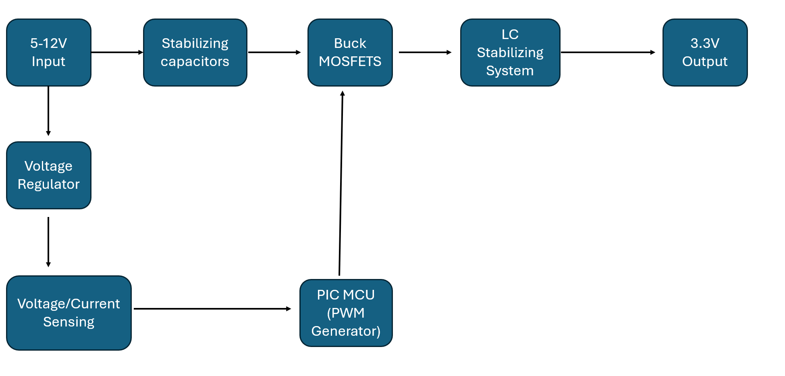
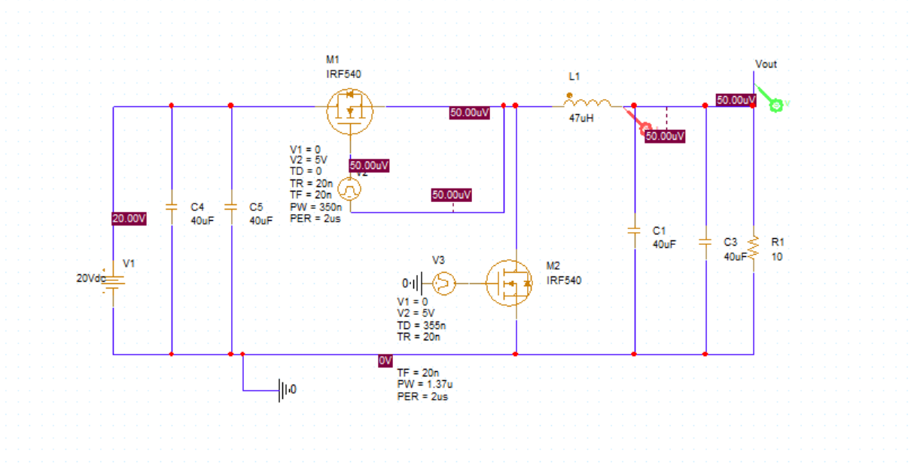
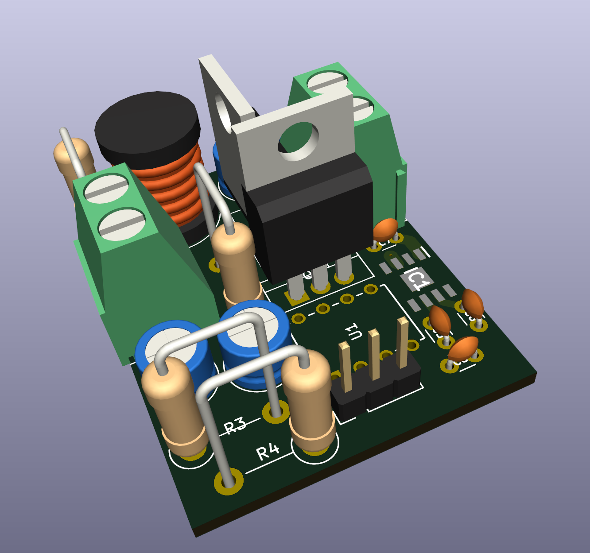
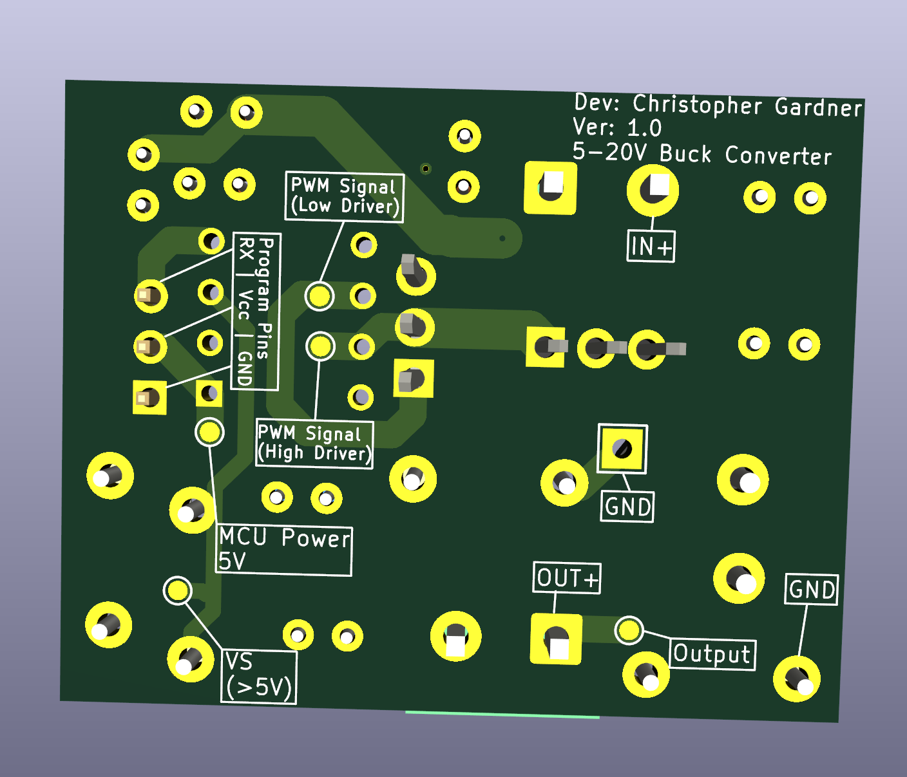

# Buck_Converter

## Overview
Designed and built a custom synchronous buck converter (5–20 V input, 3.3 V regulated output) using a PIC16F18313 microcontroller for digital PWM-based closed-loop voltage regulation. Developed embedded firmware with complementary PWM, programmable dead time, and ADC-based voltage sensing, achieving an ideal conversion efficiency of up to 95%, a 16.5% duty cycle for 20 V to 3.3 V conversion, and <1 ms settling time validated through PSpice simulation.

## Design Methods
I chose to design this buck converter as a passion project and as a backup step-down converter for another project that failed after fabrication.

The biggest goal during this was to achieve a large range of inputs (most importantly 5V due to necessity for the other project) down to a stable 3.3V. 

I ended up choosing a classic 2 MOSFET design rather than a more complex isolated design. The reason for choosing the classic 2 MOSFET design was to keep to my goal in making the smallest/cheapest to fabricated step-down converter. I ended up achieving this with a ~30mmx32mm PCB that only costed $2.00 to fabricate.  Parts costed less than $10 to populate each board.

## Specifications
<table>
  <thead>
    <tr>
      <th>Parameter</th>
      <th>Specification</th>
    </tr>
  </thead>
  <tbody>
    <tr>
      <td><strong>Input Voltage</strong></td>
      <td>5–20 V</td>
    </tr>
    <tr>
      <td><strong> Thermal Resistance</strong></td>
      <td>7.19 C @20V</td>
    </tr>
    <tr>
      <td><strong>Output Voltage</strong></td>
      <td>3.3 V</td>
    </tr>
    <tr>
      <td><strong>Switching Frequency</strong></td>
      <td>100 kHz</td>
    </tr>
    <tr>
      <td><strong>Control</strong></td>
      <td>Closed-Loop PWM</td>
    </tr>
    <tr>
      <td><strong>Dead Time</strong></td>
      <td>Programmable</td>
    </tr>
    <tr>
      <td><strong>Efficiency</strong></td>
      <td>Up to 96%</td>
    </tr>
    <tr>
      <td><strong>Settling Time</strong></td>
      <td>&lt;1 ms</td>
    </tr>
    <tr>
      <td><strong>Simulation Suite</strong></td>
      <td>PSpice</td>
    </tr>
  </tbody>
</table>

## Block Diagram

## Control Strategy
The PIC microcontroller generates complementary 100 kHz PWM signals with programmable dead time. The input signal first passes through two capacitors for input filtering and current stabilization. It then drives a MOSFET whose gate is controlled by a PWM signal. The output subsequently splits into two paths: one through a second PWM-controlled MOSFET and the other through a 47 µH inductor, which helps regulate voltage and reduce ripple. Finally, the output passes through two additional capacitors to further smooth the current and improve output stability.

## PCB Design
Optimized for a compact 30x30mm footprint to minimize fabrication time and material costs. To ensure signal integrity, high-voltage switching paths were isolated from sensitive control circuitry using strategic multi-layer routing, localized ground planes, and dedicated physical keep-out zones to mitigate EMI.
 

## Analysis Depth
To confirm my design was valid with the maximum efficiency possible, I chose to simulate my buck converter topology in PSpice. This choice did slow down development however, it allowed me to fabricate without concern over whether the hardware would work conceptually.

Some challenges I faced was that I had to alter the PWM signal because I wanted a 5V max pulse rather than a classic 10V. The 5V choice was because the max PWM output of the PIC16F18313 cannot exceed that threshold.

## Simulation Results

## Measured Results

